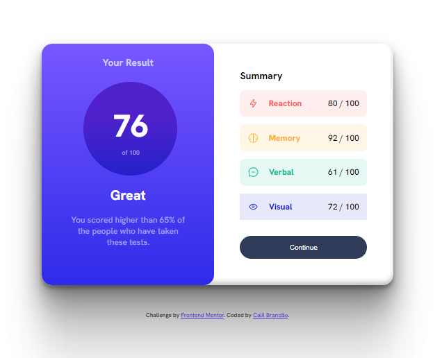
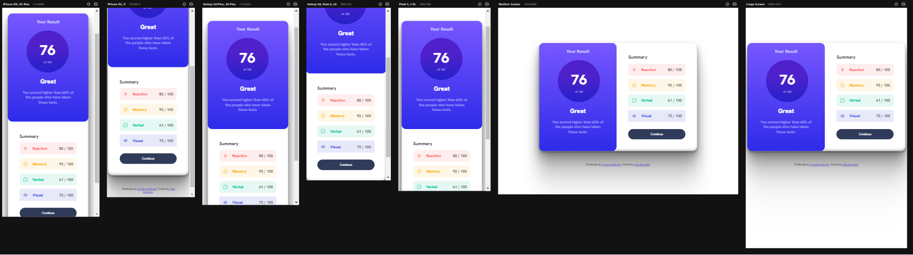

# Frontend Mentor - Results summary component

This is a solution to the [Results summary component](https://www.frontendmentor.io/challenges/results-summary-component-CE_K6s0maV/hub). Frontend Mentor challenges help you improve your coding skills by building realistic projects. 

## Table of contents

- [Overview](#overview)
  - [The challenge](#the-challenge)
  - [Screenshot](#screenshot)
  - [Links](#links)
- [My process](#my-process)
  - [Built with](#built-with)
  - [What I learned](#what-i-learned)
- [Author](#author)

## Overview

### The challenge

Users should be able to:

- View the optimal layout depending on their device's screen size
- See hover states for interactive elements

### Screenshot





### Links

- Solution URL: [Click Here](https://www.frontendmentor.io/solutions/results-summary-component-zPzcwxfMNN)
- Live Site URL: [Click Here](https://cbrandsdev.github.io/Results-Summary-Component)

## My process

### Built with

- Semantic HTML5 markup
- CSS custom properties
- Flexbox
- CSS Grid


### What I learned

In this challenge I managed to understand how the interactive elements work using hover in the css, I also managed to implement some shadows in the layout of the information box, which makes a good impression at first glance. 
I used media settings to set different settings for different mobile devices.

```css
.card {
    display: grid;
    border-radius: 10px;
    background-color: white;
    padding: 50px;
    box-shadow: rgba(0, 0, 0, 0.3) 0px 19px 38px, rgba(0, 0, 0, 0.22) 0px 15px 12px;
}
```
```css
.claim {
    font-weight: 600;
    background-color: hsl(154, 59%, 51%);
    border-radius: 5px;
    text-transform: uppercase;
    color: white;
    border: none;
    padding: 20px;
    margin-top: 30px;
}
.claim:hover {
    cursor: pointer;
    background-color: hsl(154, 55%, 59%);
    transition: all .3s;
}
```
```css
@media screen and (max-width: 920px) {
    main {
        display: grid;
        height: 100vh;
    }
    .info {
        text-align: center;
        padding: 10px;
    }
    .info h1 {
        width: 300px;
    }
    .info p {
        width: 300px;
    }

    .infos {
        width: 320px;
        text-align: center;
    }
    .card {
        width: 320px;
        align-items: center;
        justify-content: center;
    }
    .attribution {
        margin-top: 420px;
    }
```


## Author

- Github - [@CbrandsDev](https://github.com/CBrandsDev)
- Frontend Mentor - [@CBrandsDev](https://www.frontendmentor.io/profile/CBrandsDev)
- Twitter - [@onlythecalil](https://twitter.com/onlythecalil)

